Lab #1
=====

###Reading reflection

#####Open Source Definition
These guidlines are the fundimental rules for open-source software. These rules
are nearly the same as the free software movement's four basic freedoms,
allowing free redistribution of binaries, source, and derived works, and the
ability to use the software for any purpose, including commercially.
#####Asking Questions the Smart Way
Asking Questions the Smart way has a pretty good step-by-step guide on how to
ask questions online without making a fool of yourself. Having worked on an
open-source project myself, I have recieved quite a few issues that were not
truely bugs or malfunctions, but rather often user error. Despite good
documentation on how to use and configure the software appropriatly, some users
would rather immediatly take to github and open an issue rather than attempt to
first help themselves, and learn in the process. My own personal go-to methods
for problem solving are on the "Before You Ask" list: doing a web search and
reading man pages, if appropriate.
#####Free Culture
Chapter three of Free Culture highlights some of the rediculous practices by
the copyright industry. This chapter uses the story of the lawsuit against
Jesse Jordan to show the harmfulness of the copyright industry. Jordan, while
attending RPI, wrote a search engine to index content avialbe on the
institute's netowrk. His search engine uncovered a significant amount of
copyrighted work, although the total amount of work that wass subject in the
lawsuit was a small subset of all data made avilable through the engine, around
one quarter. The RIAA filed a suit against Jordan and others for "copying"
their intellectual property without authorization. Logically, this is beyond
rediculous as Jordan himself did not copy any copyrighted content, but rather
made an index of resources containing the copyrighted work. The total amount of
money demanded it the case was 15 million dollars, with the RIAA claiming over
100 instances of copyright infringement at $150,000 each. After consulting with
a lawyer within his family, he was able to settle the case by paying his entire
savings. The RIAA in this case did not do anything "moral" here by defending
their copyright, but rather used it out of greed to attack and demoralize
students attempting to better themselves through practice and research, while
improving the lives of their peers.

###Image of `tree` usage:

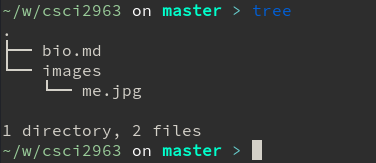

###Regex Tutorial:

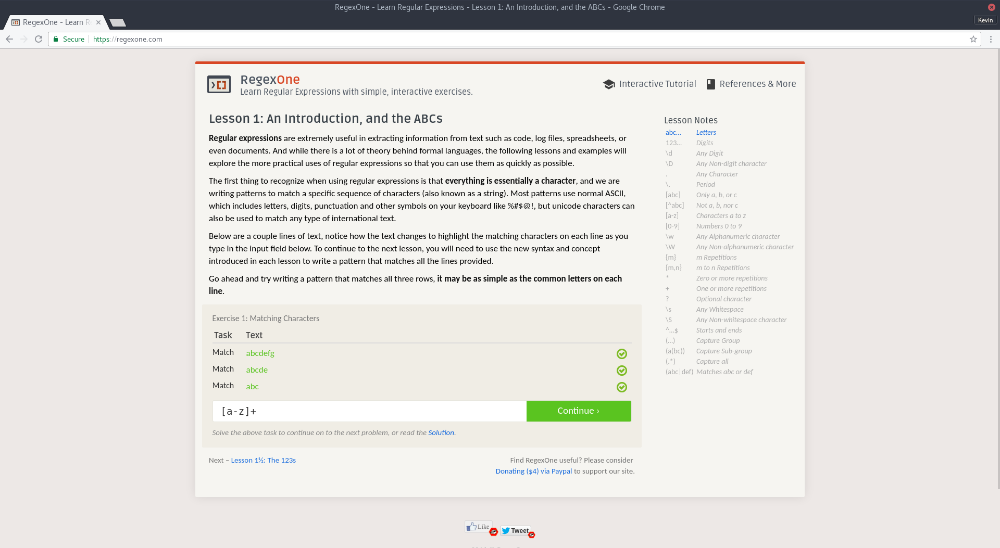

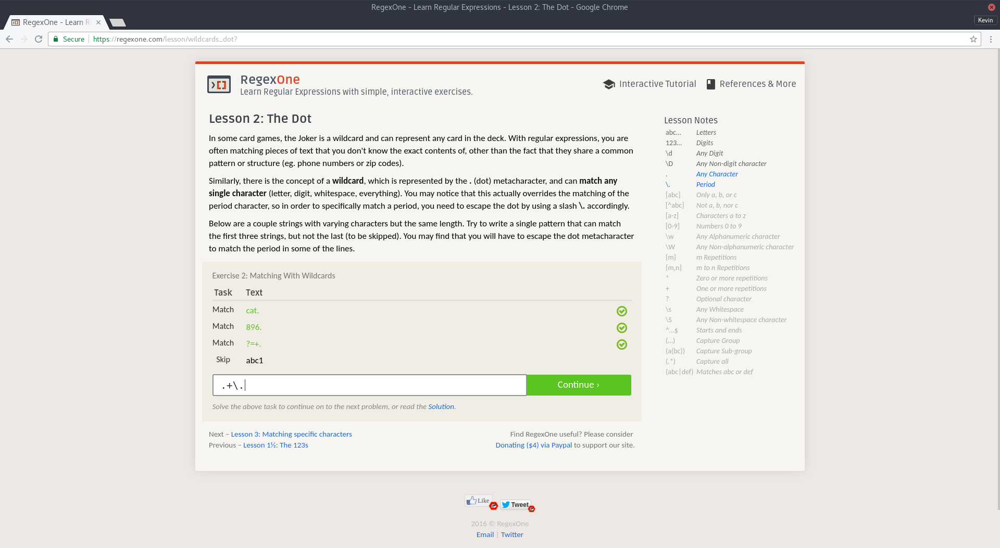
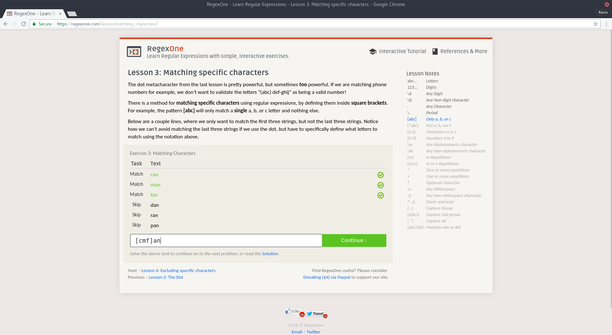
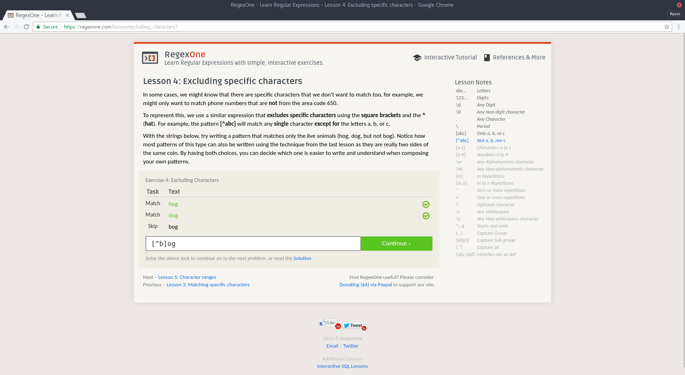
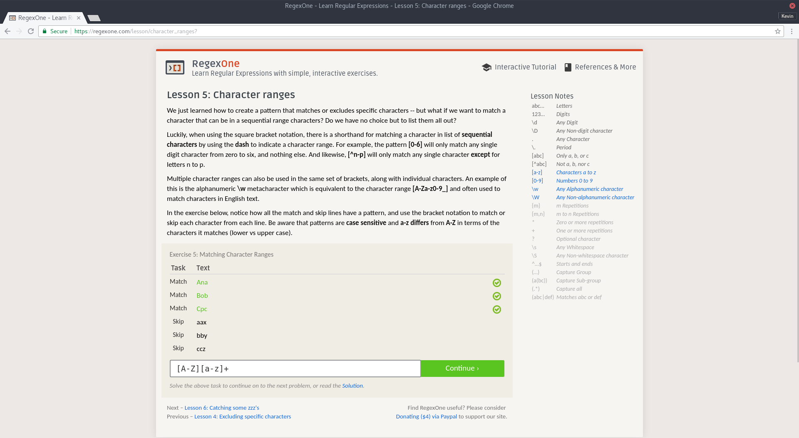
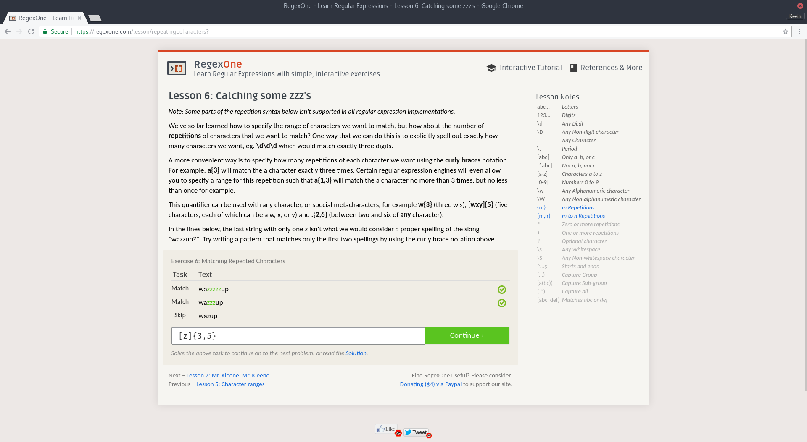
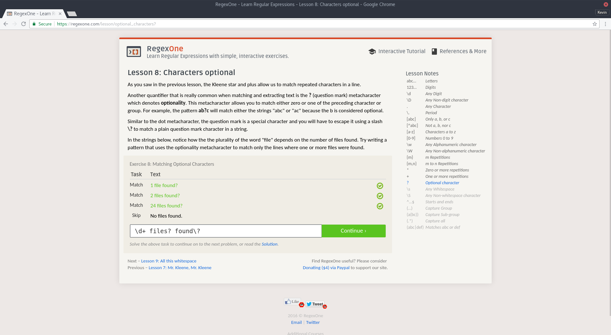
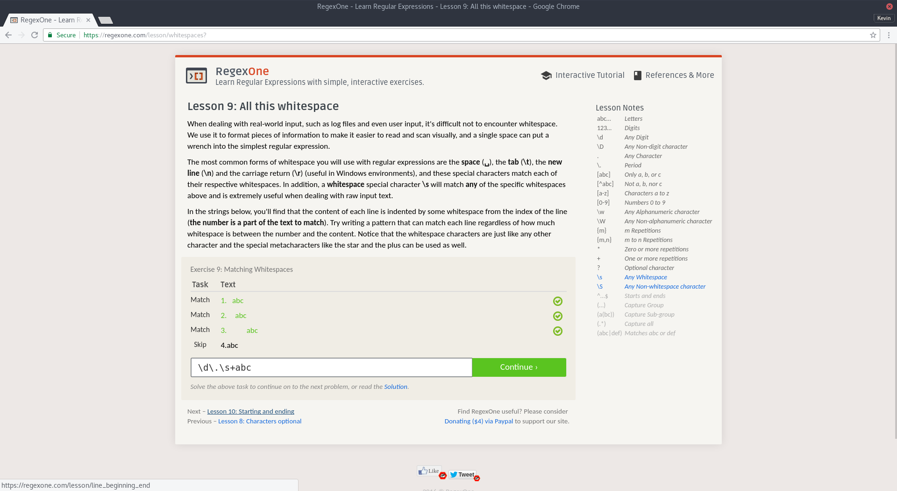
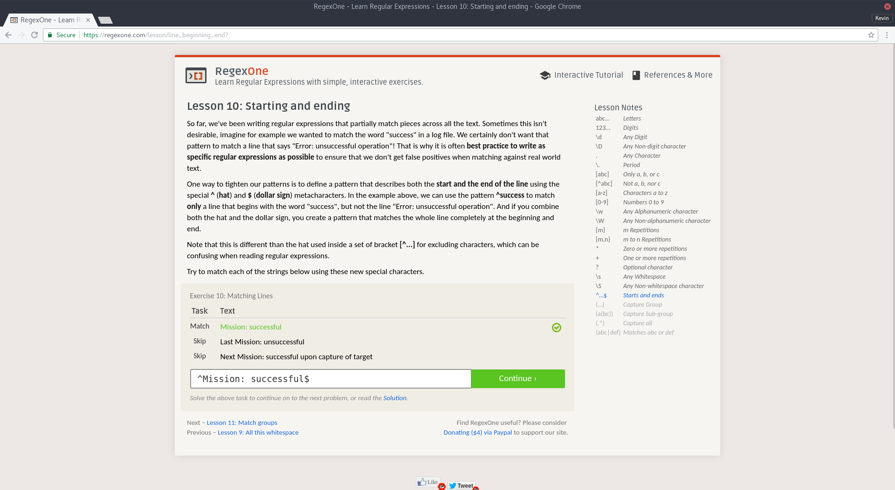

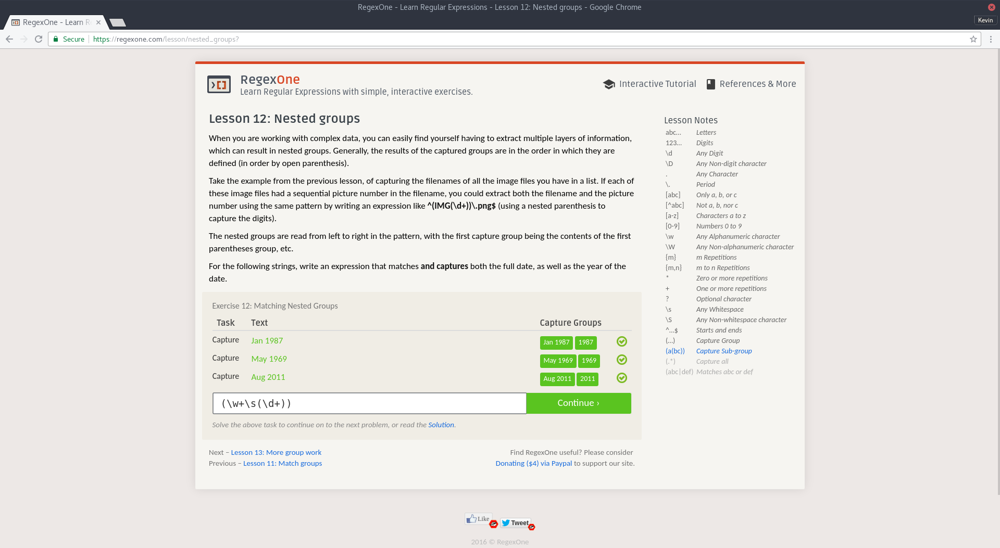
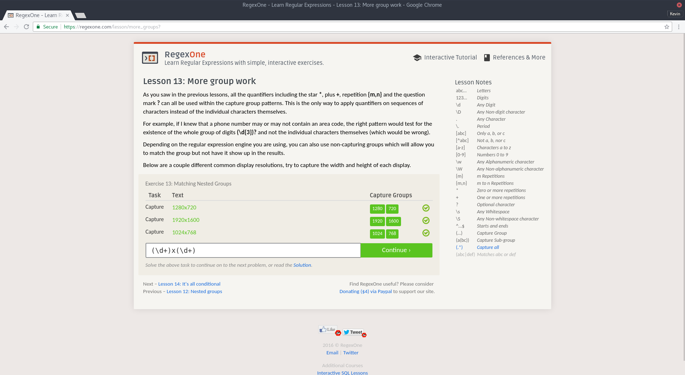
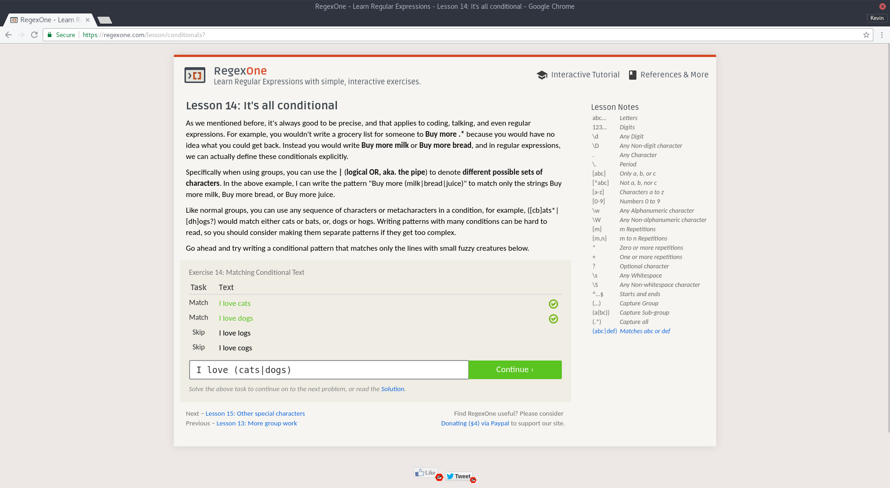
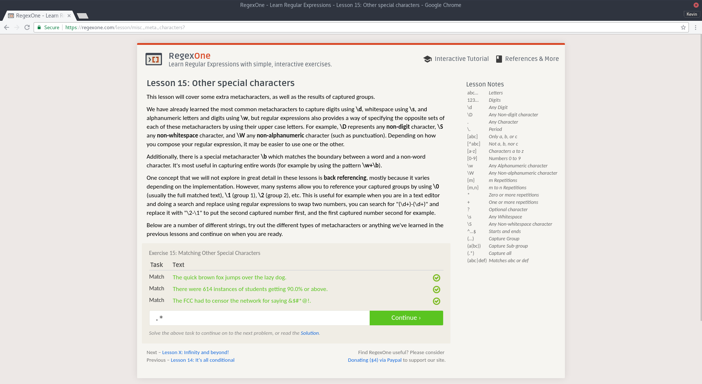


###Second Regex Tutorial:


###Solution for blocky:

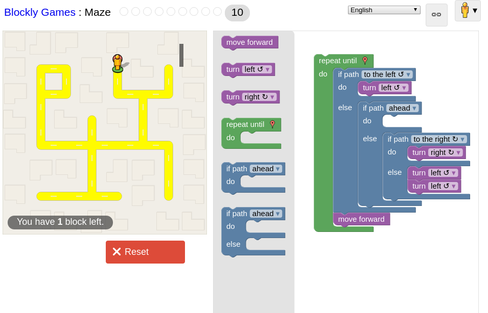

######Javascript solution output:

```js
while (notDone()) {
  if (isPathLeft()) {
    turnLeft();
  } else {
    if (isPathForward()) {
    } else {
      if (isPathRight()) {
        turnRight();
      } else {
        turnLeft();
        turnLeft();
      }
    }
  }
  moveForward();
}
```

###Interesting Problem
I am personally very interested in development tools, like git, neovim, build
tools and various shell enviroments. As most of these tools are configured
through plaintext files, it is common for developers to create "dotfiles"
repositories on GitHub to show off what programs they use and how they prefer
to use them. [Here's mine.](https://github.com/twizmwazin/dotfiles) I currently
am using GNU stow to create symblinks to my configuration files from my home
directory. This setup works well for most applications I manage through this
repository. However, there are a few tools that I am fond of that do not work
teribbly well through this system. Most notably, I've begun using the
[fish shell](https://fishshell.com/). It seems to be more complete out of the
box compared to zsh or bash, prefering sane defaults over configuration. A
favorite feature is automatic competion genoration, both for filesystems and
commands by parsing man pages. However, the plugin systems are a mess. There
are two main plugin managers,
[oh my fish](https://github.com/oh-my-fish/oh-my-fish) and
[fisherman](https://github.com/fisherman/fisherman). Both have a few strenghts,
although feature overwhelming weaknesses, in my humble opinion. Oh my fish is a
monolithic mess that bundles everything and allows you to enable plugins
included with it. It generally has patheticly slow startup times. On the other
hand, fisherman works about 88% of the way I'd like it to, and its method of
installing plugins is its main area where I take offense. It does not lend
itself well to configuring via dotfiles as I mentioned before, and doesn't seem
to consider having plugin preferences stored via dotfiles, but rather having
the user configure plugins manually using the interactive shell. I think it
would be an interesting project to either fork or clone fisherman, implenting
features and behaviors in ways that best fit my tastes. In the case that I
fork, perhaps then consider pull-requesting the changes back to the original
author.
