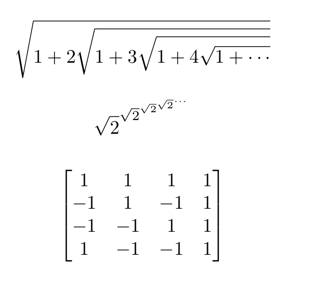
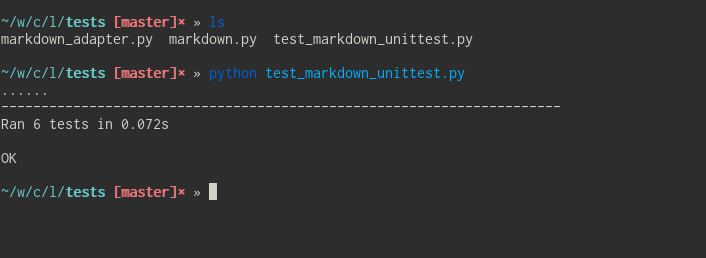

Lab 5
=====

##Step 0:
https://github.com/twizmwazin/Pigeon/wiki

##Step 1:
###OpenJavascriptWhiteboard
Contributors: 2

SLOC: 241781 (Doesn't use a .gitignore for node modules)

First Commit: 10/27/15

Latest Commit: 10/27/15

Branches: gh-pages, master, patch-1

https://youtu.be/O-CAW-NZNcI

###Ruma
Contributors: 13

SLOC: 21150

First Commit: 11/29/15

Last Commit: 2/12/17

Branches: master

https://youtu.be/GJ4tSCBb6no

###shuttle\_tracking\_2
Contributors: 7

SLOC: 2452

First Commit: 1/27/15

Last Commit: 12/8/16

Branches: admin-backend, frontend-ui, master, origin/notification-branch

https://youtu.be/R3Wbe-_RRF8

###SlickOS
Contributors: 3

SLOC: 10840

First Commit: 

Last Commit: 10/3/16

Branches: master, revert-4-master

https://youtu.be/qLBEHjnODFw

###Submitty
Contributors: 27

SLOC: 202668

First Commit: 1/31/17

Last Commit: 1/17/17

Branches: csci1100_rainbow_grades_moss_assignments_fix, evan_dev, fix_hwreport,
graded_version, grading_drafts, issue_764, issue_871, master, move_docs_folder,
peer, pylint, rewrite_database_interface, submission_status

https://youtu.be/QuPc5-EhZdg

###Comparison
Ruma and Submitty have the largest history and the most interesting statistics.
The busiest time of day for submitty is 3-4 pm. Notably, there have been almost
commits made between 4 and 8 am, I guess everyone sleeps then. In contrast,
ruma developers check the most commits in from 5-10 am.

Another difference is the growth of the project size. Submitty began small and
then exploded in size from around 100 to 600 files. On the other hand ruma
seems to grow gradually.

##Step 2:

